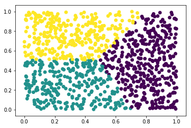

Determining Predictors of H-1B Salary and Approval (Project *DPH*)
==================================================================

Project Documentation
---------------------

**Contributors:** - Wenhao Yu (netid: *wyu1*) - Luke Duane (netid:
*lduane*) - Will Badart (netid: *wbadart*)

This project aims to provide meaningful analyses of the factors that
drive H-1B visa approval, and provide insightful, tangential analyses
which provide business value to enterprises sponsoring H-1B employees.
The project has been excecuted for Notre Dame *CSE 40647/ 60647 - Data
Science* as specified in the `project
instructions <http://www.meng-jiang.com/teaching/CSE647Spring18-Project.pdf>`__.

Installation
------------

Running the project requires `Python
3 <https://www.python.org/downloads/release/python-365/>`__. To install
the project to your system as a package, as well as its dependencies,
run:

::

    $ pip3 install git+https://github.com/wbadart/H-1B-Analyzer.git

(Remember the ``--user`` flag for systems on which you don’t have
administrative privileges.) This will also add the project’s several
entry points to your path, for running the individual analyses directly
from the command line (see `Usage <#Usage>`__).

To uninstall, run:

::

    $ pip3 uninstall h1b

Generating the Report
---------------------

The source code of the report is available under
```docs/main.tex`` <./docs/main.tex>`__ if you need to compile it to
anything other than a PDF. To compile, simple enter the documentation
folder and run ``make`` (requires ``pdflatex`` to be installed and
available on your ``PATH``).

::

    $ pwd
    /path/to/H-1B-Analyzer
    $ cd docs
    $ make

Otherwise, the complete compiled report is already checked into the
repository as
```docs/Determining Predictors of H-1B Salary and Approval.pdf`` <./docs/Determining%20Predictors%20of%20H-1B%20Salary%20and%20Approval.pdf>`__.

Acquiring the Datasets
----------------------

All the data used from this project is available for free from the Web
(see the `final
report <./docs/Determining%20Predictors%20of%20H-1B%20Salary%20and%20Approval.pdf>`__,
section 5.1 Datasets). It has been collected, archived, and been made
available as a bundle at
`wbadart.info/data.tar.gz <https://wbadart.info/data.tar.gz>`__.

::

    $ wget wbadart.info/data.tar.gz
    ...
    $ tar xzf data.tar.gz

This will unpack the ``data/`` folder into the current directory. Within
it will lie all of the pertinent data files expected by the various
scripts.

Usage
-----

All the scripts exposed by this project will read the environment
variable ``H1B_DATA`` to locate the data files described
`above <#Acquiring-the-Datasets>`__. Please ensure it is set and
accurate before attempting to run any of the scripts.

Job Title Clustering
~~~~~~~~~~~~~~~~~~~~

The submodule ``h1b.cluster`` provides a couple of utilities for
clustering the set of job titles within the primary dataset. It also
exposes a main execution, made available on the ``PATH`` as
``h1b.cluster``; it can be run as a script as follows:

::

    $ h1b.cluster --help
    usage: h1b.cluster [-h] [-n CLUSTERS]
                       [--alg {AgglomerativeClustering,KMeans,SpectralClustering}]
                       [-f FILE]

    h1b/cluster.py Find clusterings of the many thousands of job titles within the
    dataset. created: APR 2018

    optional arguments:
      -h, --help            show this help message and exit
      -n CLUSTERS, --clusters CLUSTERS
                            number of clusters (default:8)
      --alg {AgglomerativeClustering,KMeans,SpectralClustering}
                            clustering algorithm to run (default:KMeans)
      -f FILE, --file FILE  location of dataset w/in data directory
                            (default:h1b_kaggle.csv)

The most important function this module exports is called ``cluster``.

::

    $ pydoc h1b.cluster.cluster
    Help on function cluster in h1b.cluster:

    h1b.cluster.cluster = cluster(algname, n_clusters, data)
        Produce a clustering of the data according to the algorithm's `fit_predict'
        method and the `n_clusters' parameter.

Given the name of a clustering algorithm (must be one of
``AgglomerativeClustering``, ``KMeans``, and ``SpectralClustering``, but
could be easily expanded to include any clustering algorithm where the
number of clusters is fixed as a parameter; raises ``RuntimeError`` if
something other than this provided). For example:

.. code:: ipython3

    %matplotlib inline
    import matplotlib.pyplot as plt
    import numpy as np
    from h1b.cluster import cluster

    data = np.random.random((1000, 2))
    clustering = cluster('KMeans', 3, data)
    plt.scatter(data[:, 0], data[:, 1], c=clustering)


.. parsed-literal::

    <matplotlib.collections.PathCollection at 0x7f3ba9155710>





For this project, the input to the clustering was the set of job titles
from the dataset, but a simple list of strings is invlaid input to the
clustering algorithms. To solve this, we vectorized the job titles,
transforming the list of strings into a sparse matrix of word counts.
This structure is very high dimensional (``N_DIM == len(VOCAB)``) which
meant

1. Caused a serious slow down in clustering (particularly in
   ``SpectralClustering``)
2. Could not be plotted in 2D space

To remedy these, we performed a dimensionality reduction through *SVD*,
similar to the example provided below:

.. code:: ipython3

    from sklearn.feature_extraction.text import CountVectorizer
    from sklearn.decomposition import TruncatedSVD

    data = ['CHIEF EXECUTIVE', 'SOFTWARE ENGINEER']
    vec = CountVectorizer().fit_transform(data)
    svd = TruncatedSVD().fit_transform(vec)
